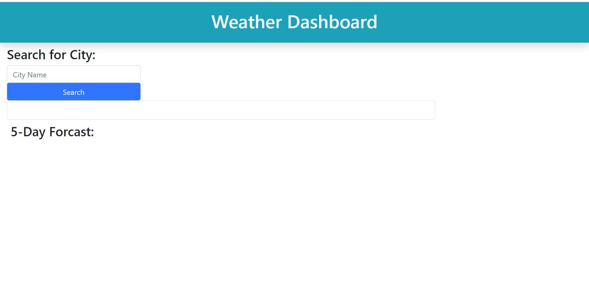

# weather-dashboard
## description
The purpose of this project was to have the user/traveler be able to enter the name of a city and be presented with current weather; and the weather for the next 5 days. The project consist of using a server-side API, the one provide was OpenWeather.

## screenshot

## built with
*html
*css
*Bootstrap
*OpenWeather API

## Website
http://aclarke0307.github.io/weather-dashboard/